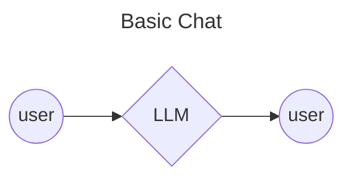
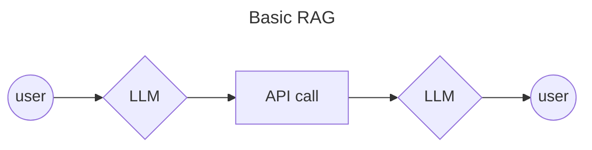
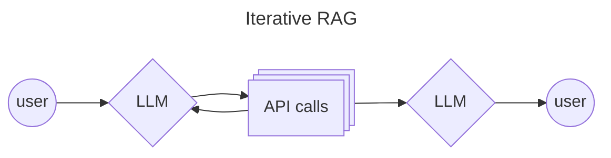
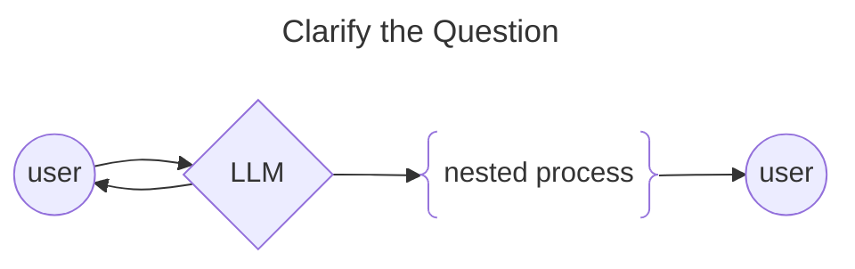
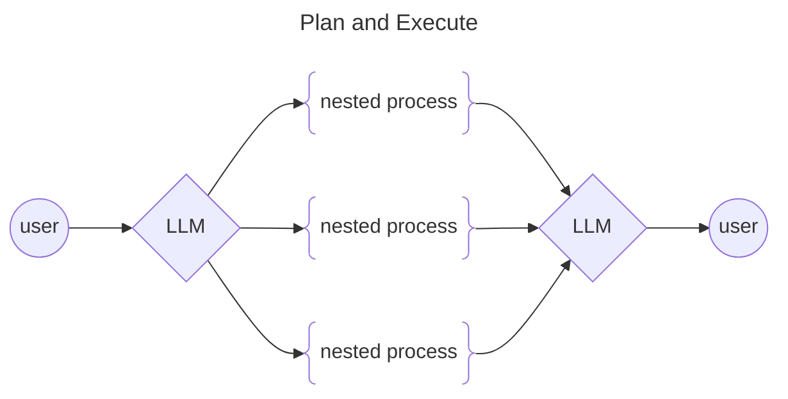
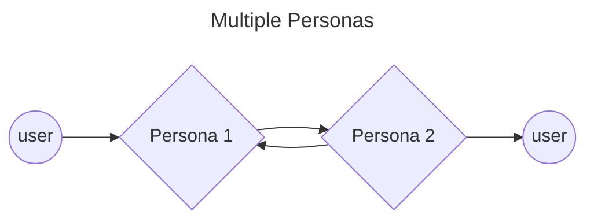

# Agent Orchestration Patterns

 
 

 
 
 

 
 
 

 
 
 

Often, users don't write descriptive prompts, and as a result they get very generic responses. To address this problem, this pattern imitates the human behavior of asking clarifying questions before attempting to answer the question. The LLM can be told to do so via the system prompt.

 
 
 

Often, LLMs can generate better responses if they are instructed to create a plan for how to answer a question, instead of attempting to answer it directly. Subprocesses are then spawned to solve parts of the plan. This narrower focus allows each subprocess to generate a richer answer.

 
 

For use cases that require creative problem solving, it can be useful to have an LLM with two or more "personas" have a conversation with itself. This can be achieved with a different system prompt creating each persona.